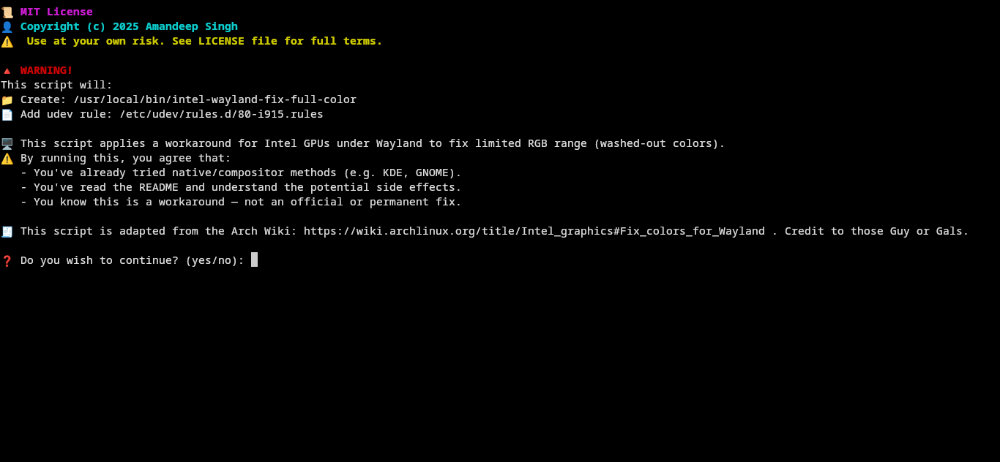

# Intel-wayland-full-color-fix

**Tired of your screen looking like a 2003 washed-out LCD? This fixes full RGB range on Intel iGPUs under Wayland.**\

---

## ⚠️ Disclaimer First (Seriously)

This script is based on info from the [Arch Wiki](https://wiki.archlinux.org/title/Intel_graphics#Fix_colors_for_Wayland). Use at your own risk.

- 🧠 Only for **Intel GPUs** using the `i915` driver
- 🐧 Designed for **Wayland sessions**, especially **Hyprland**
- 🧪 **KDE Plasma 6** has native support (check Display Settings first)
- 📚 **GNOME** users: might work, but check the [Wiki](https://wiki.archlinux.org/title/Intel_graphics#Fix_colors_for_Wayland) first
- ❓ On **Arch-based distros**, your mileage may vary (especially with modified kernels)
- 🧪 On **Non-Arch distros** like Debian/Fedora/etc — feel free to try, but don’t expect miracles
- 💥 I’m not responsible for broken displays, failed boots, or your system spiraling into an existential crisis

---

## 💡 What It Actually Does

- Writes a script to `/usr/local/bin/intel-wayland-fix-full-color`
- Adds a `udev` rule to `/etc/udev/rules.d/80-i915.rules`
- Uses `proptest` to enable **full RGB range** on Intel iGPUs
- Activates automatically on boot or when the `i915` module loads

---

## 📦 Requirements

| What               | Why                                  |
| ------------------ | ------------------------------------ |
| Arch Linux         | That’s what this was built on        |
| Intel GPU          | Specifically using the `i915` module |
| Wayland            | X11 users, this isn’t for you        |
| `proptest`         | Comes with `libdrm`                  |
| `sudo` or `pkexec` | This script needs system access      |

---

## ⚙️ Installation Guide

```bash
chmod +x install_intel_color_fix.sh
./install_intel_color_fix.sh
```

- Prompts before writing any file
- Shows you the scripts before installing
- Makes everything executable
- Reloads udev rules if needed

🔁 **REBOOT after installing**. If you don’t see any color change, uninstall it:

```bash
./uninstall_intel_color_fix.sh
```

---

## ❌ Uninstalling

Simple and clean. Reverts the changes.

```bash
chmod +x uninstall_intel_color_fix.sh
./uninstall_intel_color_fix.sh
```

---

## 📸 CLI Screenshot

This is how the script politely asks for your permission before touching your system (unlike some install.sh monsters out there):



---

## 🧠 Why This Exists

It took me **6 months** of staring at a washed-out screen before I found the problem. Intel defaults to *limited RGB* on Wayland. This script applies the fix **automatically** using tools from the Arch Wiki.

No screenshots here. Your **eyes** will be the judge.

---

## 📝 License

[MIT](LICENSE) — because open-source legalese should be one page, not a trilogy.  
Use it, modify it, make memes with it — just credit me.  
If it breaks your system, monitor, or soul — don’t sue me. You’ve been warned.

---
